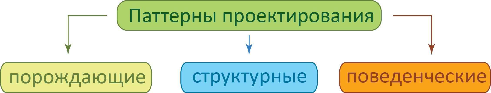
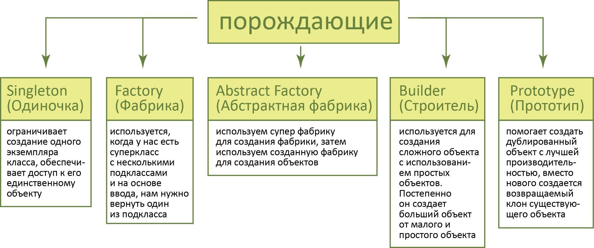
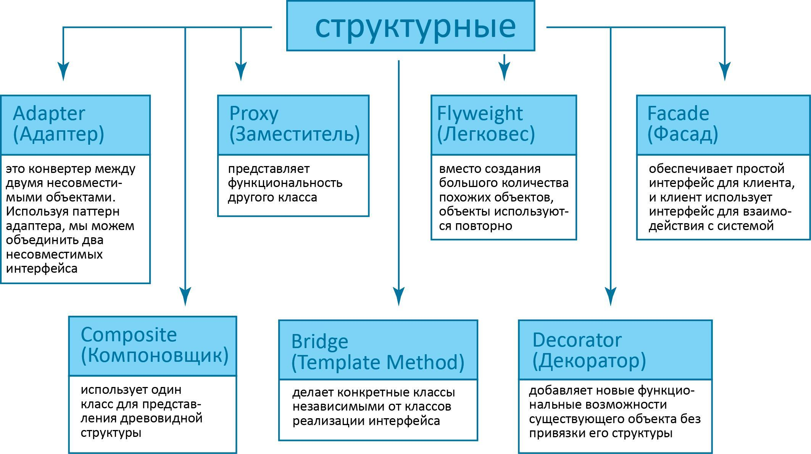
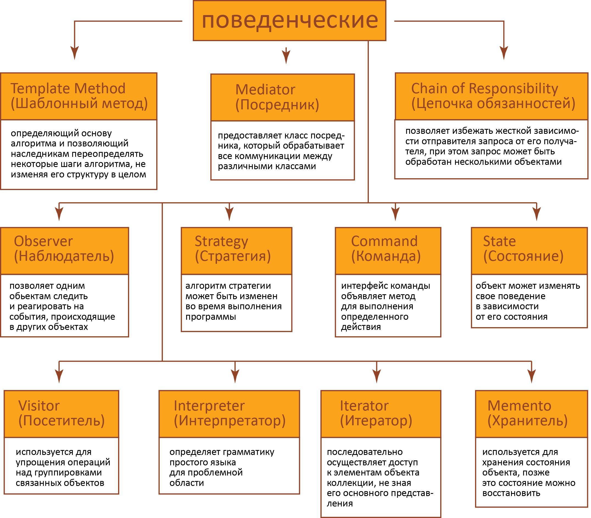

### Типы паттернов в Java:
- порождающие
- структурные
- поведенческие

Порождающие паттерны предоставляют механизмы инициализации, позволяя создавать объекты удобным способом.

Структурные паттерны определяют отношения между классами и объектами, позволяя им работать совместно.

Поведенческие паттерны используются для того, чтобы упростить взаимодействие между сущностями.

